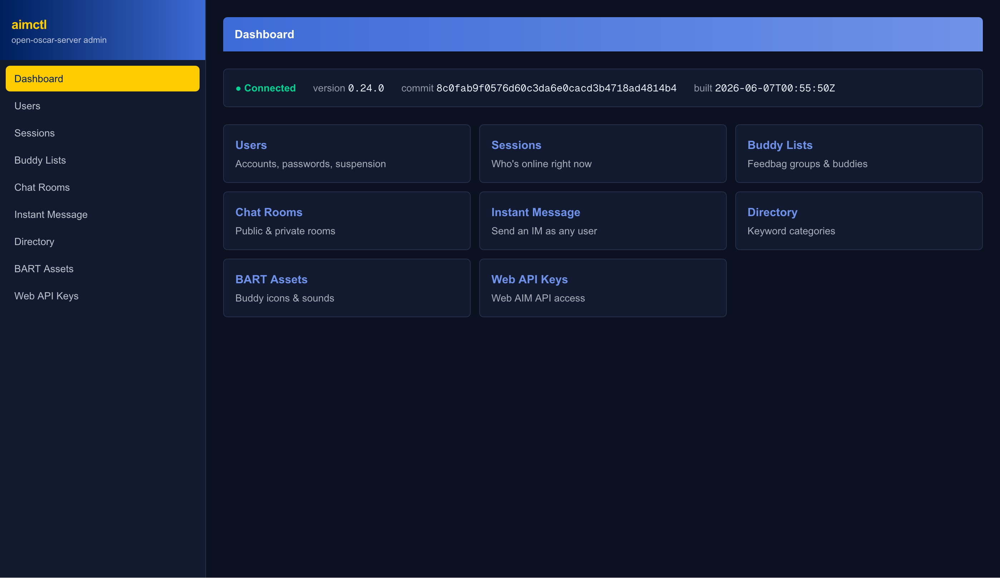

# Open Oscar Admin UI



A local admin UI for [open-oscar-server](https://github.com/mk6i/open-oscar-server), an AIM/ICQ-compatible chat server. Built with Next.js 16, React 19, and Tailwind v4.

There's no authentication — this is meant to run on your local network, next to the server it manages, not exposed to the internet.

## Features

- **Users** — list, create, delete accounts; set passwords; suspend/unsuspend; toggle bot status; view account details and buddy icon.
- **Sessions** — see who's currently online (idle time, away status, IP:port per connected instance) and disconnect a session.
- **Buddy Lists** — view and edit a user's feedbag: groups, buddies, and linked accounts.
- **Chat Rooms** — create/list/delete public rooms; view private rooms and their participants.
- **Instant Message** — send a test IM from one screen name to another.
- **Directory** — manage the keyword categories and keywords used in the buddy directory.
- **BART Assets** — browse, upload, and delete buddy icons and other BART assets by type.
- **Web API Keys** — issue and manage credentials for the separate Web AIM API (rate limits, allowed origins, capabilities), including the one-time secret reveal on creation.
- **ICQ Profile** — view and edit the full ICQ profile (contact info, work info, notes, interests, affiliations, permissions) for ICQ accounts.

## Setup

1. Have an open-oscar-server instance running somewhere reachable.
2. Install dependencies:
   ```bash
   yarn install
   ```
3. Point the app at your server:
   ```bash
   cp .env.local.example .env.local
   # edit AIMCTL_API_BASE_URL if your server isn't on localhost:8080
   ```
4. Run it:
   ```bash
   yarn dev      # development, http://localhost:3000 (or next available port)
   # or
   yarn build && yarn start   # production
   ```

## Docker Setup

### Command Line

1. Set up the configuration:
   ```bash
   cp .env.local.example .env
   # edit AIMCTL_API_BASE_URL if your server isn't on localhost:8080
   ```
2. Run this command, subtituting where relevant:
   ```bash
   docker run -d \
   --name=open-oscar-admin-ui \
   -p 3000:3000 \ # e.g. if you want to access with port 80, use 80:3030
   --restart unless-stopped \
   ghcr.io/geoffoliver/open-oscar-admin-ui:latest
   ```

### Docker Compose

1. Set up your configuration, like the command line's first step or concatenate the example into your existing `.env`.
2. Add the following to your `{docker-}compose.yml`, removing `services:` if you have others alongside it:
   ```yaml
   services:
     open-oscar-admin-ui:
       image: ghcr.io/geoffoliver/open-oscar-admin-ui:latest
       container_name: open-oscar-admin-ui
       ports:
         - 3000:3000
       restart: unless-stopped
   ```
3. Launch the service:
   ```bash
   docker compose up -d
   ```

## How it talks to the server

`open-oscar-server`'s admin API generally won't have CORS configured for a browser origin, so the browser never calls it directly. A catch-all route handler at `app/api/[...path]/route.ts` proxies every request server-to-server — the browser only ever talks to the app's own origin. `AIMCTL_API_BASE_URL` is a server-only environment variable; it's never sent to the client.

## API spec

`docs/api.yml` is the source of truth this UI is built against, kept in sync by hand with the server's actual admin API (including a few endpoints — like the ICQ profile and the full BART type enum — that the server implements but doesn't document itself). If you're adding a feature, check there first.

Two things currently in `docs/api.yml` that this UI calls but that older `open-oscar-server` builds don't implement yet: adding a new feedbag group (`PUT /feedbag/{screen_name}/group/{group_name}`), and the entire Linked Accounts endpoint set. On a server predating those handlers, the app detects the route-not-found response and shows "not supported on this server version" instead of a raw error — that's the server lagging behind, not a bug here.

## Project structure

- `app/<section>/page.tsx` — one route per nav section, plus `app/users/[screenname]/` and `app/feedbag/[screenname]/` for per-user detail pages.
- `app/lib/api-client.ts` — typed wrappers over the proxy, one function per API call.
- `app/lib/types.ts` — TypeScript types mirroring `docs/api.yml`'s schemas.
- `app/components/ui/` — shared primitives (`Button`, `Dialog`, `ConfirmDialog`, `Table`, `Badge`, `PageHeader`, `Sidebar`, toasts).
- `app/<section>/_components/` — components specific to one section.
